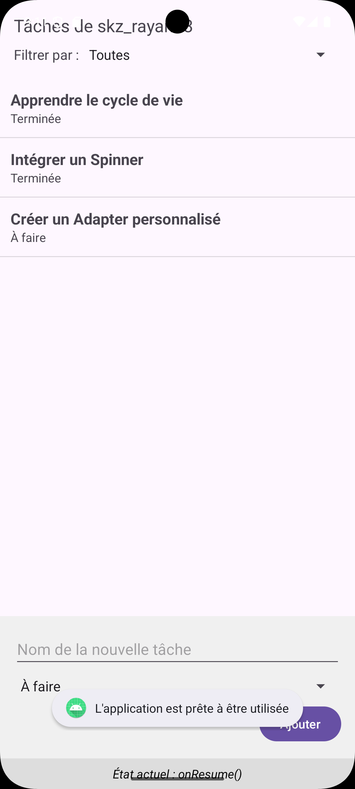
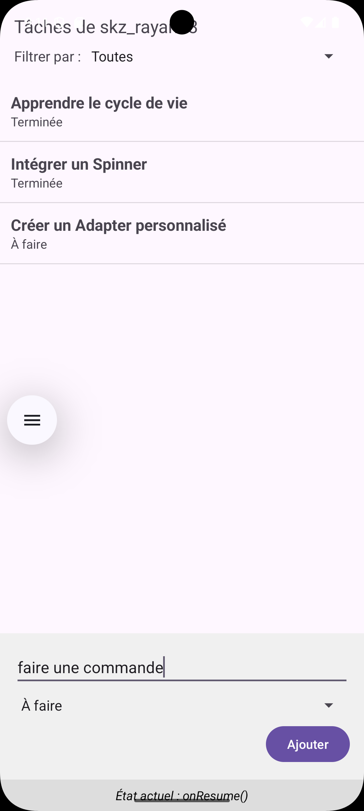
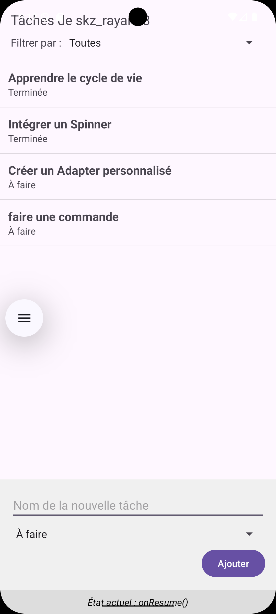
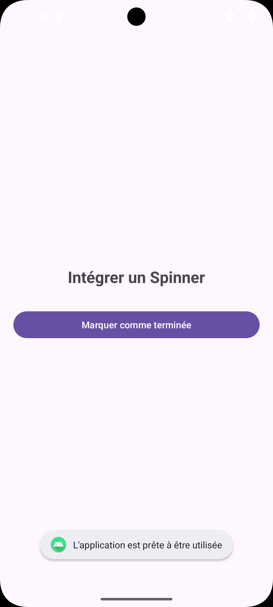
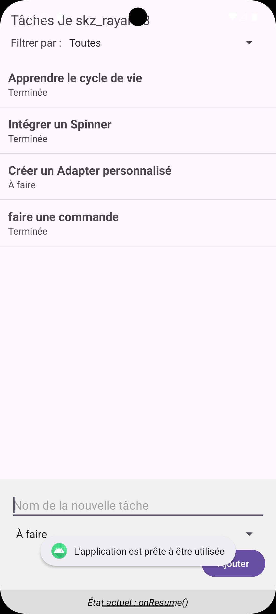

# TP7 Java Cycle de Vie - Application Android

## Description

Ce projet est une application Android démontrant le cycle de vie des activités Android (Activity Lifecycle). L'application permet aux utilisateurs de gérer leurs tâches personnelles tout en illustrant les différentes phases du cycle de vie d'une activité Android : `onCreate()`, `onStart()`, `onResume()`, `onPause()`, `onStop()`, `onRestart()` et `onDestroy()`.

## Fonctionnalités

- **Authentification** : Écran de connexion pour saisir un nom d'utilisateur
- **Tableau de bord** : Page principale avec bienvenue personnalisé
- **Gestion de profil** : Modification du nom d'utilisateur
- **Gestion des tâches** : Création, visualisation et mise à jour des tâches
- **Filtrage des tâches** : Possibilité de filtrer par statut ("Toutes", "À faire", "Terminée")
- **Détails des tâches** : Vue détaillée pour chaque tâche
- **Suivi du cycle de vie** : Affichage en temps réel de l'état actuel de l'activité

## Structure de l'application

- **LoginActivity** : Écran de connexion initial
- **MainActivity** : Tableau de bord principal après connexion
- **ProfileActivity** : Gestion du profil utilisateur
- **TasksActivity** : Gestion complète des tâches avec cycle de vie implémenté
- **TaskDetailActivity** : Détails d'une tâche spécifique
- **Task** : Classe modèle pour représenter une tâche
- **TaskAdapter** : Adaptateur personnalisé pour afficher les tâches dans la liste

## Technologies utilisées

- **Langage** : Java
- **SDK** : Android API 36 (Android 13+)
- **Minimum SDK** : API 24 (Android 7.0)
- **Architecture** : Activities et Fragments
- **Dépendances** : AndroidX AppCompat, Material Design, ConstraintLayout

## Cycle de vie des activités

L'application met en évidence les différentes phases du cycle de vie :

- **onCreate()** : Initialisation de l'activité
- **onStart()** : L'activité devient visible
- **onResume()** : L'activité est interactive
- **onPause()** : L'activité perd le focus
- **onStop()** : L'activité n'est plus visible
- **onRestart()** : L'activité redémarre après avoir été arrêtée
- **onDestroy()** : L'activité est sur le point d'être détruite

## Installation

1. Clonez ce dépôt :
   ```bash
   git clone https://github.com/votre-compte/TP7JavaCycleDeVie.git
   ```

2. Ouvrez le projet dans Android Studio

3. Synchronisez le projet avec Gradle

4. Exécutez l'application sur un émulateur ou un appareil Android (API 24 ou supérieur)

## Capture d'écrans

Voici quelques captures d'écran montrant l'application en action :

### Écran de connexion
<div align="center">
  
</div>

### Étapes de développement
#### Étape 1 - Activité avec Spinner
<div align="center">
  
</div>

#### Étape 2 - Activité avec Liste
<div align="center">
  
  
</div>
<div align="center">
  
</div>

#### Étape 3 - Activité avec Grille
<div align="center">
  
  
</div>

### Interface finale de gestion des tâches
<div align="center">
  
</div>

### Autres captures d'écran de l'application
<div align="center">
  
  
</div>
<div align="center">
  
  
</div>
<div align="center">
  
  
</div>
<div align="center">
  
  
</div>

## Vidéo de démonstration

Une vidéo de démonstration de l'application est également disponible :
[Enregistrement vidéo de l'application](assets/Screen_recording_20251116_154123.webm)

## Architecture du projet

```
app/
├── src/main/
│   ├── java/com/example/tp7java_cycle_de_vie/
│   │   ├── LoginActivity.java      # Écran de connexion
│   │   ├── MainActivity.java       # Tableau de bord principal
│   │   ├── ProfileActivity.java    # Gestion du profil
│   │   ├── TasksActivity.java      # Gestion des tâches avec cycle de vie
│   │   ├── TaskDetailActivity.java # Détails d'une tâche
│   │   ├── Task.java               # Modèle de données pour une tâche
│   │   └── TaskAdapter.java        # Adaptateur pour la liste des tâches
│   └── res/                       # Ressources (layouts, drawables, etc.)
└── build.gradle                   # Configuration du module
```

## Points clés pédagogiques

Ce projet illustre plusieurs concepts importants du développement Android :

1. **Cycle de vie des activités** : Compréhension des différentes phases
2. **Navigation entre activités** : Utilisation d'Intent pour passer des données
3. **Communication entre activités** : Retour d'informations avec setResult()
4. **Adaptateurs personnalisés** : Création d'un adaptateur pour ListView
5. **Interaction utilisateur** : Gestion des événements de clic
6. **Filtrage de données** : Filtrage dynamique des tâches affichées
7. **Gestion des états** : Sauvegarde et restauration de l'état

## Remarques

- L'application utilise des messages Toast pour notifier les transitions de cycle de vie
- Une boîte de dialogue AlertDialog est affichée lors des transitions onStop() et onRestart()
- Les tâches sont stockées en mémoire et ne persistent pas après la fermeture de l'application
- L'application est entièrement en français comme indiqué dans les captures d'écran

## Auteur

Projet réalisé dans le cadre du TP7 sur le cycle de vie des activités Android.